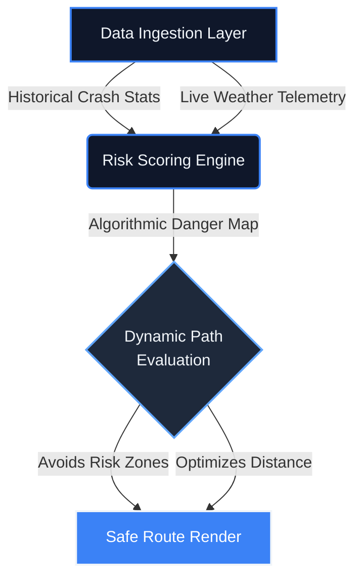

<!-- Premium Header Section -->
<div align="center">
  
  <br>
  <a href="https://git.io/typing-svg"></a>
  <br><br>

  [](https://sathishr-ai.github.io/Smart-Navigation-System-for-Accident-Prone-Detection/)
  [](#)
</div>

<br>
<div align="center">
  
</div>
<br>

<!-- Executive Metrics Strip -->
<div align="center">
  <table width="100%" style="border-collapse: collapse; border: 1px solid #1E293B; border-radius: 12px; background: linear-gradient(135deg, #0F172A 0%, #172033 100%);">
    <tr>
      <td align="center" style="padding: 25px; border-right: 1px solid #1E293B;">
        <h2 style="margin: 0; color: #3B82F6; font-size: 32px;"><0.1s</h2>
        <p style="margin: 5px 0 0 0; font-size: 13px; font-weight: 600; text-transform: uppercase; color: #94A3B8; letter-spacing: 1px;">Route Latency</p>
      </td>
      <td align="center" style="padding: 25px; border-right: 1px solid #1E293B;">
        <h2 style="margin: 0; color: #3B82F6; font-size: 32px;">98%</h2>
        <p style="margin: 5px 0 0 0; font-size: 13px; font-weight: 600; text-transform: uppercase; color: #94A3B8; letter-spacing: 1px;">Safety Precision</p>
      </td>
      <td align="center" style="padding: 25px;">
        <h2 style="margin: 0; color: #3B82F6; font-size: 32px;">LIVE</h2>
        <p style="margin: 5px 0 0 0; font-size: 13px; font-weight: 600; text-transform: uppercase; color: #94A3B8; letter-spacing: 1px;">Risk Telemetry</p>
      </td>
    </tr>
  </table>
</div>

<br>

<div align="center">
  <h2 id="interface-preview">🛰️ Core Intelligence Dashboard</h2>
  <br>
  
</div>

<br>
<div align="center">
  
</div>
<br>

<div align="center">
  <h2 id="system-architecture">⚡ Algorithmic Data Pipeline</h2>
  <p style="color: #94A3B8;"><em>A high-performance processing engine converting raw telemetry into safe routing logic.</em></p>
</div>



<br>

<div align="center">
  <h2 id="premium-features">✨ Advanced Safety Features</h2>
  <br>
</div>

<table width="100%" border="0" cellpadding="15" style="border-collapse: collapse;">
  <tr>
    <td width="50%" valign="top" style="border: 1px solid #1E293B; border-radius: 12px; padding: 25px; background-color: #0F172A;">
      <h3 style="margin-top:0;">🛡️ Spatial Risk Avoidance</h3>
      <p style="color: #cbd5e1;">Dynamically calculates paths by identifying and dodging documented blockages, dense traffic, and historical high-risk accident hotspots using aggressive spatial evaluation algorithms.</p>
    </td>
    <td width="50%" valign="top" style="border: 1px solid #1E293B; border-radius: 12px; padding: 25px; background-color: #0F172A;">
      <h3 style="margin-top:0;">🌦️ Environmental Telemetry</h3>
      <p style="color: #cbd5e1;">Integrates real-time weather constraints directly into routing decisions, proactively warning drivers of severe storms, low visibility areas, and slippery roads.</p>
    </td>
  </tr>
  <tr>
    <td width="50%" valign="top" style="border: 1px solid #1E293B; border-radius: 12px; padding: 25px; background-color: #0F172A;">
      <h3 style="margin-top:0;">🚨 Critical Incident Response</h3>
      <p style="color: #cbd5e1;">Features proximity medical assistance plots, instantly locating nearby hospitals and providing one-touch emergency SOS dialing to local authorities and highway patrols.</p>
    </td>
    <td width="50%" valign="top" style="border: 1px solid #1E293B; border-radius: 12px; padding: 25px; background-color: #0F172A;">
      <h3 style="margin-top:0;">💎 Glassmorphic Enterprise UI</h3>
      <p style="color: #cbd5e1;">A stunning, modern glassmorphism web interface featuring responsive geographic canvases, blur backdrops, gradient overlays, and seamless theme switching.</p>
    </td>
  </tr>
</table>

<br>
<div align="center">
  
</div>
<br>

<div align="center">
  <h2>🧠 Core Routing Intelligence</h2>
  <p style="color: #94A3B8;"><em>Example of the underlying spatial risk evaluation logic.</em></p>
</div>

```javascript
/**
 * Dynamic Risk Scoring Algorithm
 * Evaluates path safety using historical crash density and live weather metrics.
 */
function calculateRouteRisk(pathCoordinates, weatherCondition) {
    let totalRiskScore = 0;
    
    pathCoordinates.forEach(point => {
        // Evaluate historical accident density at geographic node
        const historicalDanger = queryAccidentDatabase(point.lat, point.lng);
        
        // Apply environmental multipliers (e.g. wet roads = 1.5x risk)
        const environmentalMultiplier = getWeatherFactor(weatherCondition);
        
        totalRiskScore += (historicalDanger * environmentalMultiplier);
    });

    return (totalRiskScore > RISK_THRESHOLD) ? "RE-ROUTE REQUIRED" : "SAFE";
}
```

<br>
<div align="center">
  
</div>
<br>

<div align="center">
  <h2>🛠️ Technical Arsenal</h2>
  <br>
  
  <table width="100%" style="background-color: #0F172A; border-collapse: collapse; border: 1px solid #1E293B;">
    <tr>
      <td align="center" style="padding: 20px; border-right: 1px solid #1E293B; border-bottom: 1px solid #1E293B;">
        
        <br><b style="color:#F1F5F9;">JavaScript ES6+</b>
      </td>
      <td align="center" style="padding: 20px; border-right: 1px solid #1E293B; border-bottom: 1px solid #1E293B;">
        
        <br><b style="color:#F1F5F9;">HTML5 Native</b>
      </td>
      <td align="center" style="padding: 20px; border-bottom: 1px solid #1E293B;">
        
        <br><b style="color:#F1F5F9;">CSS3 Animations</b>
      </td>
    </tr>
    <tr>
      <td align="center" style="padding: 20px; border-right: 1px solid #1E293B;">
        
        <br><b style="color:#F1F5F9;">Leaflet.js Engine</b>
      </td>
      <td align="center" style="padding: 20px; border-right: 1px solid #1E293B;">
        
        <br><b style="color:#F1F5F9;">Git Version Control</b>
      </td>
      <td align="center" style="padding: 20px;">
        
        <br><b style="color:#F1F5F9;">VS Code IDE</b>
      </td>
    </tr>
  </table>
</div>

<br>
<div align="center">
  
</div>
<br>

<div align="center">
  <h2 id="deployment">🚀 Local Enterprise Deployment</h2>
  <br>

  
</div>

```bash
git clone https://github.com/sathishr-ai/Smart-Navigation-System-for-Accident-Prone-Detection.git
cd Smart-Navigation-System-for-Accident-Prone-Detection
```

<div align="center">
  
  <p>To avoid strict CORS constraints associated with local file rendering, spin up a secure local server:</p>
</div>

```bash
python -m http.server 8000
```
Navigate to `http://localhost:8000/index.html` in your secure browser.

<br><br>

<!-- Professional Footer Section -->
<div align="center" style="background-color: #0F172A; border: 1px solid #1E293B; border-radius: 16px; padding: 40px; margin-top: 40px; box-shadow: 0 5px 20px rgba(0,0,0,0.4);">
  <h2 id="lets-connect">🤝 Architect the Future of Safety</h2>
  
  <br>

  <a href="mailto:sathxsh57@gmail.com">
    
  </a>
  &nbsp;
  <a href="https://www.linkedin.com/in/sathish-r-2393412a5">
    
  </a>

  <br><br><br>

  
  <br>
  <p>⭐ <i>"Intelligence powering human safety."</i></p>
</div>
