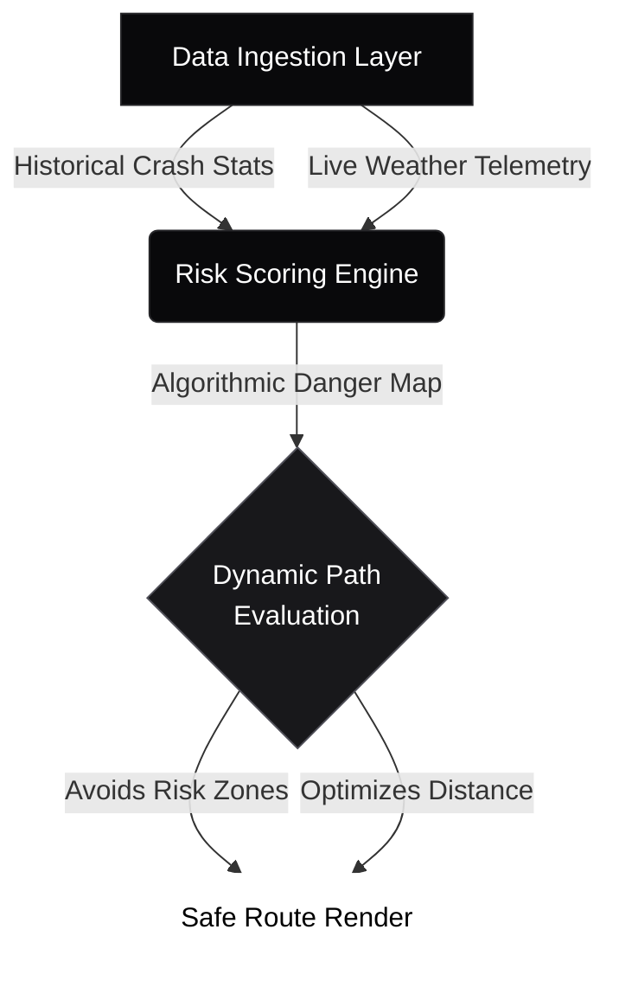

<!-- Stealth Enterprise Header -->
<div align="center">
  
  <br>
  
  <a href="https://git.io/typing-svg">
    
  </a>
  <br><br>

  [](https://sathishr-ai.github.io/Smart-Navigation-System-for-Accident-Prone-Detection/)
  [](#)
</div>

<br><br>

<!-- Strategic Overview -->
<div align="center">
  <h2 style="color: #FFFFFF; font-family: -apple-system, BlinkMacSystemFont, Segoe UI, sans-serif; letter-spacing: -0.5px;">THE ARCHITECTURE OF SAFETY</h2>
  <p style="color: #A1A1AA; max-width: 800px; font-size: 16px; line-height: 1.8; font-weight: 300;">
    Traditional navigation optimizes purely for speed. This geographic engine introduces a fundamental paradigm shift: aggregating historical crash telemetry and live atmospheric data to dynamically score physical paths. If a route crosses an active risk threshold, it aggressively auto-corrects to <b>prioritize driver survivability over estimated time of arrival</b>.
  </p>
</div>

<br><br><br>

<!-- Executive Metrics -->
<div align="center">
  <h2 style="font-family: -apple-system, BlinkMacSystemFont, Segoe UI, sans-serif; letter-spacing: -0.5px;">EXECUTIVE TELEMETRY</h2><br>
  <table width="100%" style="border-collapse: collapse; border: 1px solid #27272A; border-radius: 8px; background-color: #09090B;">
    <tr>
      <td align="center" style="padding: 35px; border-right: 1px solid #27272A;">
        <h2 style="margin: 0; color: #FFFFFF; font-size: 40px; font-weight: 500;"><0.1s</h2>
        <p style="margin: 8px 0 0 0; font-size: 12px; font-weight: 600; text-transform: uppercase; color: #71717A; letter-spacing: 2px;">Route Latency</p>
      </td>
      <td align="center" style="padding: 35px; border-right: 1px solid #27272A;">
        <h2 style="margin: 0; color: #FFFFFF; font-size: 40px; font-weight: 500;">98%</h2>
        <p style="margin: 8px 0 0 0; font-size: 12px; font-weight: 600; text-transform: uppercase; color: #71717A; letter-spacing: 2px;">Safety Precision</p>
      </td>
      <td align="center" style="padding: 35px;">
        <h2 style="margin: 0; color: #FFFFFF; font-size: 40px; font-weight: 500;">LIVE</h2>
        <p style="margin: 8px 0 0 0; font-size: 12px; font-weight: 600; text-transform: uppercase; color: #71717A; letter-spacing: 2px;">Risk Overlays</p>
      </td>
    </tr>
  </table>
</div>

<br><br><br>

<div align="center">
  <h2 style="font-family: -apple-system, BlinkMacSystemFont, Segoe UI, sans-serif; letter-spacing: -0.5px;">CORE INTELLIGENCE DASHBOARD</h2>
  <br>
  
</div>

<br><br><br>

<div align="center">
  <h2 style="font-family: -apple-system, BlinkMacSystemFont, Segoe UI, sans-serif; letter-spacing: -0.5px;">ALGORITHMIC DATA PIPELINE</h2>
  <p style="color: #A1A1AA; font-weight: 300;"><em>High-performance engine mapping raw telemetry into safe routing logic.</em></p>
  <br>
</div>



<br><br><br>

<div align="center">
  <h2 style="font-family: -apple-system, BlinkMacSystemFont, Segoe UI, sans-serif; letter-spacing: -0.5px;">ROUTING LOGIC ENGINE</h2>
  <p style="color: #A1A1AA; font-weight: 300;"><em>The mathematical constraint model evaluating hazard survivability.</em></p>
  <br>
</div>

```javascript
/**
 * Dynamic Risk Scoring Algorithm
 * Prioritizes survival probability over ETA optimizations.
 */
function calculateRouteRisk(pathCoordinates, liveWeather) {
    let aggregateRisk = 0;
    
    pathCoordinates.forEach(node => {
        // Fetch precise historical incident volume
        const incidentDensity = queryAccidentDatabase[node.lat][node.lng];
        
        // Fetch atmospheric traction modifiers
        const weatherMultiplier = getTractionPenalty(liveWeather);
        
        // Scale risk exponentially for highly dangerous combined nodes
        aggregateRisk += (incidentDensity * Math.pow(weatherMultiplier, 1.5));
    });

    return (aggregateRisk > GLOBAL_RISK_TOLERANCE) ? "RE_ROUTE_TRIGGERED" : "PATH_CLEARED";
}
```

<br><br><br>

<div align="center">
  <h2 style="font-family: -apple-system, BlinkMacSystemFont, Segoe UI, sans-serif; letter-spacing: -0.5px;">TECHNICAL ARSENAL</h2>
  <br>
  
  <table width="100%" style="background-color: #09090B; border-collapse: collapse; border: 1px solid #27272A; border-radius: 8px; overflow: hidden;">
    <tr>
      <td align="center" style="padding: 30px; border-right: 1px solid #27272A; border-bottom: 1px solid #27272A;">
        
        <br><br><b style="color:#A1A1AA; font-size:12px; letter-spacing: 1px; text-transform: uppercase;">JavaScript ES6+</b>
      </td>
      <td align="center" style="padding: 30px; border-right: 1px solid #27272A; border-bottom: 1px solid #27272A;">
        
        <br><br><b style="color:#A1A1AA; font-size:12px; letter-spacing: 1px; text-transform: uppercase;">HTML5 Native</b>
      </td>
      <td align="center" style="padding: 30px; border-bottom: 1px solid #27272A;">
        
        <br><br><b style="color:#A1A1AA; font-size:12px; letter-spacing: 1px; text-transform: uppercase;">CSS3 Architecture</b>
      </td>
    </tr>
    <tr>
      <td align="center" style="padding: 30px; border-right: 1px solid #27272A;">
        
        <br><br><b style="color:#A1A1AA; font-size:12px; letter-spacing: 1px; text-transform: uppercase;">Geospatial Engine</b>
      </td>
      <td align="center" style="padding: 30px; border-right: 1px solid #27272A;">
        
        <br><br><b style="color:#A1A1AA; font-size:12px; letter-spacing: 1px; text-transform: uppercase;">Version Control</b>
      </td>
      <td align="center" style="padding: 30px;">
        
        <br><br><b style="color:#A1A1AA; font-size:12px; letter-spacing: 1px; text-transform: uppercase;">IDE Environment</b>
      </td>
    </tr>
  </table>
</div>

<br><br><br>

<div align="center">
  <h2 style="font-family: -apple-system, BlinkMacSystemFont, Segoe UI, sans-serif; letter-spacing: -0.5px;">RAPID LOCAL DEPLOYMENT</h2>
  <br>
</div>

```bash
# 1. Clone the intelligence repository
git clone https://github.com/sathishr-ai/Smart-Navigation-System-for-Accident-Prone-Detection.git
cd Smart-Navigation-System-for-Accident-Prone-Detection

# 2. Spin up a secure local server to bypass cross-origin restrictions
python -m http.server 8000
```
**Access Point:** Navigate to `http://localhost:8000/index.html` in any Chromium-based browser.

<br><br><br><br>

<!-- Stealth Engineering Footer -->
<div align="center">
  <div style="background-color: #09090B; border: 1px solid #27272A; border-radius: 8px; padding: 50px; box-shadow: 0 10px 40px rgba(0,0,0,0.8);">
    
    <a href="https://sathishdev.vercel.app/">
      
    </a>
    
    <p style="color: #A1A1AA; font-size: 15px; margin-top: 15px; max-width: 600px; line-height: 1.8; font-weight: 300;">
      Engineering high-performance probabilistic models, resilient machine learning pipelines, and highly scalable geographic architectures.
    </p>
    
    <br><br>

    <a href="https://sathishdev.vercel.app/">
      
    </a>
    &nbsp;&nbsp;
    <a href="https://www.linkedin.com/in/sathish-r-2393412a5">
      
    </a>
    &nbsp;&nbsp;
    <a href="mailto:sathxsh57@gmail.com">
      
    </a>

    <br><br><br>
    
    <p style="font-size: 11px; color: #52525B; letter-spacing: 2px; text-transform: uppercase;">
      © 2026 SATHISH R | ENGINEERED FOR MINIMAL LATENCY. BUILT FOR GLOBAL IMPACT.
    </p>
  </div>
</div>
