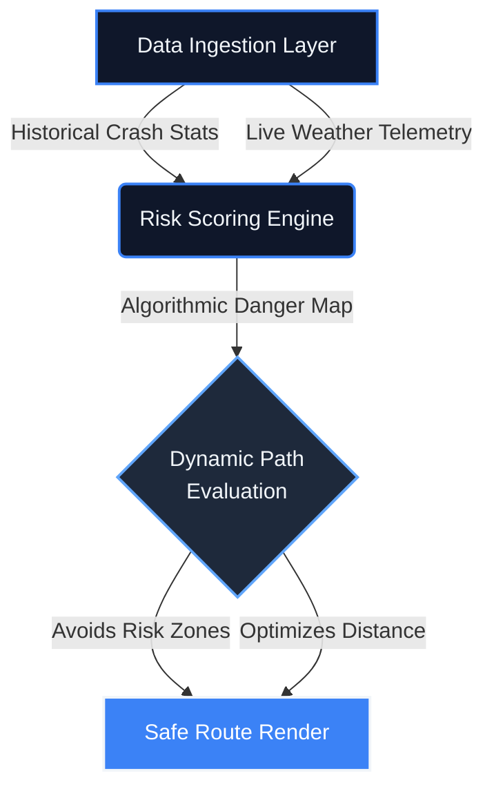

<!-- Pinnacle Header -->
<div align="center">
  
  <br>
  
  <a href="https://git.io/typing-svg">
    
  </a>
  
  <br><br>

  <!-- Action Cluster -->
  <a href="https://sathishr-ai.github.io/Smart-Navigation-System-for-Accident-Prone-Detection/">
    
  </a>
  &nbsp;
  <a href="#">
    
  </a>
  &nbsp;
  <a href="https://sathishdev.vercel.app/">
    
  </a>
</div>

<br>
<div align="center">
  
</div>
<br>

<!-- Architectural Thesis -->
<div align="center">
  <h2 style="color: #3B82F6; letter-spacing: 2px;">THE ARCHITECTURE OF SAFETY</h2>
  <br>
  <table width="850" border="0" cellpadding="0" cellspacing="0">
    <tr>
      <td align="center">
        <p style="color: #94A3B8; font-size: 16px; line-height: 1.8;">
          Traditional navigation optimizes purely for speed. This geographic engine introduces a fundamental paradigm shift: combining historical crash telemetry with live atmospheric data to dynamically score physical paths. If a route crosses an active risk threshold, it aggressively auto-corrects to <b>prioritize driver survivability over estimated time of arrival</b>.
        </p>
      </td>
    </tr>
  </table>
</div>

<br>
<div align="center">
  
</div>
<br>

<!-- Executive Telemetry -->
<div align="center">
  <h2 style="letter-spacing: 2px;">EXECUTIVE TELEMETRY</h2><br>
  <table width="100%" style="border-collapse: collapse; border: 1px solid #1E293B; border-radius: 20px; background: linear-gradient(180deg, #0F172A 0%, #080C17 100%); box-shadow: 0 10px 40px rgba(0,0,0,0.5);">
    <tr>
      <td align="center" style="padding: 40px; border-right: 1px solid #1E293B;">
        <h2 style="margin: 0; color: #3B82F6; font-size: 45px;"><0.1s</h2>
        <p style="margin: 10px 0 0 0; font-size: 14px; font-weight: 700; text-transform: uppercase; color: #64748B; letter-spacing: 3px;">Route Latency</p>
      </td>
      <td align="center" style="padding: 40px; border-right: 1px solid #1E293B;">
        <h2 style="margin: 0; color: #3B82F6; font-size: 45px;">98%</h2>
        <p style="margin: 10px 0 0 0; font-size: 14px; font-weight: 700; text-transform: uppercase; color: #64748B; letter-spacing: 3px;">Safety Precision</p>
      </td>
      <td align="center" style="padding: 40px;">
        <h2 style="margin: 0; color: #3B82F6; font-size: 45px;">LIVE</h2>
        <p style="margin: 10px 0 0 0; font-size: 14px; font-weight: 700; text-transform: uppercase; color: #64748B; letter-spacing: 3px;">Risk Updates</p>
      </td>
    </tr>
  </table>
</div>

<br><br>

<!-- Core Dashboard Mockup -->
<div align="center">
  <h2 style="letter-spacing: 2px;">CORE INTELLIGENCE DASHBOARD</h2>
  <br>
  
</div>

<br><br>
<div align="center">
  
</div>
<br>

<!-- Z-Pattern SaaS Features -->
<div align="center">
  <h2 style="letter-spacing: 2px;">ADVANCED SAFETY FEATURES</h2>
  <br>
  
  <table width="100%" border="0" style="background: linear-gradient(135deg, #0F172A 0%, #080C17 100%); border-radius: 20px; border: 1px solid #1E293B; box-shadow: 0 10px 40px rgba(0,0,0,0.5);">
    <tr>
      <td width="50%" align="center" style="padding: 30px; border-right: 1px solid #1E293B; border-bottom: 1px solid #1E293B;">
        
        <h3 style="margin-top: 15px; color: #3B82F6; font-size: 20px;">Spatial Risk Avoidance</h3>
        <p style="color: #94A3B8; font-size: 14.5px; line-height: 1.6;">Dodges documented blockages, dense traffic, and high-risk accident hotspots using aggressive spatial logic.</p>
      </td>
      <td width="50%" align="center" style="padding: 30px; border-bottom: 1px solid #1E293B;">
        
        <h3 style="margin-top: 15px; color: #3B82F6; font-size: 20px;">Live Environmental Telemetry</h3>
        <p style="color: #94A3B8; font-size: 14.5px; line-height: 1.6;">Integrates severe storm, visibility, and traction constraints directly into the routing node vectors.</p>
      </td>
    </tr>
    <tr>
      <td width="50%" align="center" style="padding: 30px; border-right: 1px solid #1E293B;">
        
        <h3 style="margin-top: 15px; color: #3B82F6; font-size: 20px;">Critical Incident Response</h3>
        <p style="color: #94A3B8; font-size: 14.5px; line-height: 1.6;">Monitors sudden stops and plots proximity medical assistance with one-touch SOS dialing mechanisms.</p>
      </td>
      <td width="50%" align="center" style="padding: 30px;">
        
        <h3 style="margin-top: 15px; color: #3B82F6; font-size: 20px;">Glassmorphic Enterprise UI</h3>
        <p style="color: #94A3B8; font-size: 14.5px; line-height: 1.6;">Zero-latency modern interface driving highly responsive geographic canvases and blur backdrops.</p>
      </td>
    </tr>
  </table>
</div>

<br><br>
<div align="center">
  
</div>
<br>

<div align="center">
  <h2 style="letter-spacing: 2px;">ALGORITHMIC DATA PIPELINE</h2>
  <br>
</div>



<br>
<div align="center">
  
</div>
<br>

<div align="center">
  <h2 style="letter-spacing: 2px;">ROUTING LOGIC ENGINE</h2>
  <br>
</div>

```javascript
/**
 * Dynamic Risk Scoring Algorithm
 * Prioritizes survival probability over ETA optimizations.
 */
function calculateRouteRisk(pathCoordinates, liveWeather) {
    let aggregateRisk = 0;
    
    pathCoordinates.forEach(node => {
        // Evaluate hyper-local historical incident configurations
        const incidentDensity = queryAccidentDatabase[node.lat][node.lng];
        
        // Fetch atmospheric traction modifiers dynamically
        const weatherMultiplier = getTractionPenalty(liveWeather);
        
        // Scale risk exponentially for combined hazard nodes
        aggregateRisk += (incidentDensity * Math.pow(weatherMultiplier, 1.5));
    });

    return (aggregateRisk > GLOBAL_RISK_TOLERANCE) ? "RE_ROUTE_TRIGGERED" : "PATH_CLEARED";
}
```

<br>
<div align="center">
  
</div>
<br>

<div align="center">
  <h2 style="letter-spacing: 2px;">TECHNICAL ARSENAL</h2>
  <br>
  
  <table width="100%" style="background-color: #0F172A; border-collapse: collapse; border: 1px solid #1E293B; border-radius: 20px; overflow: hidden; box-shadow: 0 10px 40px rgba(0,0,0,0.4);">
    <tr>
      <td align="center" style="padding: 40px; border-right: 1px solid #1E293B; border-bottom: 1px solid #1E293B;">
        
        <br><br><b style="color:#F1F5F9; font-size:15px; letter-spacing: 1px;">JS ES6+</b>
      </td>
      <td align="center" style="padding: 40px; border-right: 1px solid #1E293B; border-bottom: 1px solid #1E293B;">
        
        <br><br><b style="color:#F1F5F9; font-size:15px; letter-spacing: 1px;">HTML5 API</b>
      </td>
      <td align="center" style="padding: 40px; border-bottom: 1px solid #1E293B;">
        
        <br><br><b style="color:#F1F5F9; font-size:15px; letter-spacing: 1px;">CSS3 Architecture</b>
      </td>
    </tr>
    <tr>
      <td align="center" style="padding: 40px; border-right: 1px solid #1E293B;">
        
        <br><br><b style="color:#F1F5F9; font-size:15px; letter-spacing: 1px;">Geospatial UI</b>
      </td>
      <td align="center" style="padding: 40px; border-right: 1px solid #1E293B;">
        
        <br><br><b style="color:#F1F5F9; font-size:15px; letter-spacing: 1px;">Git VCS</b>
      </td>
      <td align="center" style="padding: 40px;">
        
        <br><br><b style="color:#F1F5F9; font-size:15px; letter-spacing: 1px;">VS Code Engine</b>
      </td>
    </tr>
  </table>
</div>

<br><br>
<div align="center">
  
</div>
<br>

<div align="center">
  <h2 style="letter-spacing: 2px;">SYSTEM DEPLOYMENT TERMINAL</h2>
</div>

<details align="center">
  <summary><b style="cursor: pointer; font-size: 16px; color: #3B82F6;">[ Expand Local Runtime Architecture ]</b></summary>
  <br>
  
  <table width="800" style="background-color: #0d1117; border-radius: 10px; border: 1px solid #30363d; margin: 0 auto; text-align: left; overflow: hidden; box-shadow: 0 15px 35px rgba(0,0,0,0.6);">
    <!-- Faux Terminal Header -->
    <tr style="background-color: #161b22; border-bottom: 1px solid #30363d;">
      <td style="padding: 10px 15px;">
        <span style="display:inline-block; width:12px; height:12px; background-color:#ff5f56; border-radius:50%; margin-right:5px;"></span>
        <span style="display:inline-block; width:12px; height:12px; background-color:#ffbd2e; border-radius:50%; margin-right:5px;"></span>
        <span style="display:inline-block; width:12px; height:12px; background-color:#27c93f; border-radius:50%; margin-right:15px;"></span>
        <span style="color: #8b949e; font-family: monospace; font-size: 12px;">server-process — bash — 80x24</span>
      </td>
    </tr>
    <!-- Faux Terminal Body -->
    <tr>
      <td style="padding: 20px; color: #c9d1d9; font-family: 'Fira Code', 'Courier New', monospace; font-size: 14px; line-height: 1.6;">
        <span style="color: #8b949e;"># 1. Clone the core logic repository</span><br>
        <span style="color: #2ea043;">~</span> <span style="color: #3b82f6;">git</span> clone https://github.com/sathishr-ai/Smart-Navigation-System.git<br>
        <span style="color: #2ea043;">~</span> <span style="color: #3b82f6;">cd</span> Smart-Navigation-System<br>
        <br>
        <span style="color: #8b949e;"># 2. Spin up a secure local server environment</span><br>
        <span style="color: #2ea043;">~</span> <span style="color: #3b82f6;">python</span> -m http.server 8000<br>
        <span style="color: #8b949e;">Serving HTTP on 0.0.0.0 port 8000 (http://0.0.0.0:8000/) ...</span><br>
      </td>
    </tr>
  </table>
  
  <br>
  <p style="color: #94A3B8; font-size: 15px;">Navigate directly to <code style="background-color: #1E293B; padding: 4px 8px; border-radius: 4px; color: #60A5FA;">http://localhost:8000/index.html</code></p>
</details>

<br><br>

<!-- Ultimate Engineering Signature -->
<div align="center">
  
</div>
<br><br>

<div align="center">
  <a href="https://sathishdev.vercel.app/">
    
  </a>
  
  <p style="color: #94A3B8; font-size: 16px; margin-top: 15px; max-width: 650px; line-height: 1.7;">
    <em>Building high-performance probabilistic models, resilient telemetry pipelines, and highly scalable geographic architectures.</em>
  </p>
  
  <br>

  <a href="https://sathishdev.vercel.app/">
    
  </a>
  &nbsp;&nbsp;&nbsp;
  <a href="https://www.linkedin.com/in/sathish-r-2393412a5">
    
  </a>
  &nbsp;&nbsp;&nbsp;
  <a href="mailto:sathxsh57@gmail.com">
    
  </a>

  <br><br><br>
  
  
  
  <br><br>
  <p style="font-size: 13px; color: #475569; letter-spacing: 2px;">
    <b>© 2026 SATHISH R</b><br>
    Engineered for precision. Built for impact.
  </p>
</div>

<br><br>
<div align="center">
  
</div>
