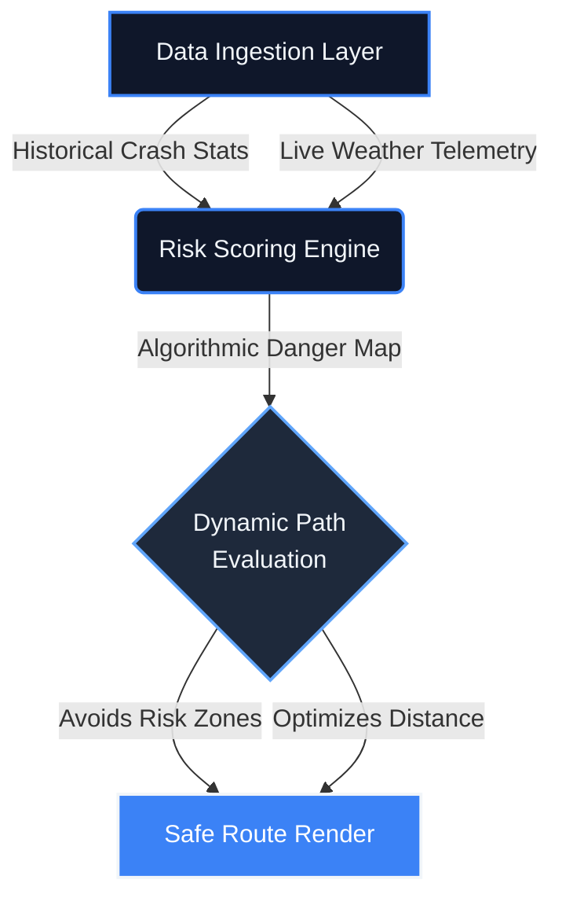

<!-- Ultra-Premium Header -->
<div align="center">
  
  <br>
  
  <a href="https://git.io/typing-svg">
    
  </a>
  <br><br>

  [](https://sathishr-ai.github.io/Smart-Navigation-System-for-Accident-Prone-Detection/)
  [](#)
</div>

<br>
<div align="center">
  
</div>
<br>

<!-- Strategic Overview -->
<div align="center">
  <h2 style="color: #3B82F6;">🌍 The Architecture of Safety</h2>
  <p style="color: #94A3B8; max-width: 800px; font-size: 16px; line-height: 1.6;">
    Traditional navigation optimizes purely for speed. This geographic engine introduces a paradigm shift: aggregating historical crash telemetry and live atmospheric data to dynamically score physical paths. If a route crosses an active risk threshold, it aggressively auto-corrects to <b>prioritize driver survivability over estimated time of arrival</b>.
  </p>
</div>

<br>
<div align="center">
  
</div>
<br>

<!-- Executive Metrics -->
<div align="center">
  <h2>📊 Executive Telemetry</h2><br>
  <table width="100%" style="border-collapse: collapse; border: 1px solid #1E293B; border-radius: 12px; background: linear-gradient(135deg, #0F172A 0%, #172033 100%);">
    <tr>
      <td align="center" style="padding: 30px; border-right: 1px solid #1E293B;">
        <h2 style="margin: 0; color: #3B82F6; font-size: 36px;"><0.1s</h2>
        <p style="margin: 5px 0 0 0; font-size: 13px; font-weight: 600; text-transform: uppercase; color: #94A3B8; letter-spacing: 1.5px;">Route Latency</p>
      </td>
      <td align="center" style="padding: 30px; border-right: 1px solid #1E293B;">
        <h2 style="margin: 0; color: #3B82F6; font-size: 36px;">98%</h2>
        <p style="margin: 5px 0 0 0; font-size: 13px; font-weight: 600; text-transform: uppercase; color: #94A3B8; letter-spacing: 1.5px;">Safety Precision</p>
      </td>
      <td align="center" style="padding: 30px;">
        <h2 style="margin: 0; color: #3B82F6; font-size: 36px;">LIVE</h2>
        <p style="margin: 5px 0 0 0; font-size: 13px; font-weight: 600; text-transform: uppercase; color: #94A3B8; letter-spacing: 1.5px;">Risk Overlays</p>
      </td>
    </tr>
  </table>
</div>

<br>

<div align="center">
  <h2>🛰️ Core Intelligence Dashboard</h2>
  <br>
  
</div>

<br>
<div align="center">
  
</div>
<br>

<div align="center">
  <h2>⚡ Algorithmic Data Pipeline</h2>
  <p style="color: #94A3B8;"><em>High-performance engine mapping raw telemetry into safe routing logic.</em></p>
</div>



<br>
<div align="center">
  
</div>
<br>

<div align="center">
  <h2>🧠 Routing Logic Engine</h2>
  <p style="color: #94A3B8;"><em>The mathematical constraint model evaluating hazard survivability.</em></p>
</div>

```javascript
/**
 * Dynamic Risk Scoring Algorithm
 * Prioritizes survival probability over ETA optimizations.
 */
function calculateRouteRisk(pathCoordinates, liveWeather) {
    let aggregateRisk = 0;
    
    pathCoordinates.forEach(node => {
        // Fetch precise historical incident volume
        const incidentDensity = queryAccidentDatabase[node.lat][node.lng];
        
        // Fetch atmospheric traction modifiers
        const weatherMultiplier = getTractionPenalty(liveWeather);
        
        // Scale risk exponentially for highly dangerous combined nodes
        aggregateRisk += (incidentDensity * Math.pow(weatherMultiplier, 1.5));
    });

    return (aggregateRisk > GLOBAL_RISK_TOLERANCE) ? "RE_ROUTE_TRIGGERED" : "PATH_CLEARED";
}
```

<br>
<div align="center">
  
</div>
<br>

<div align="center">
  <h2>🛠️ Technical Arsenal</h2>
  <br>
  
  <table width="100%" style="background-color: #0F172A; border-collapse: collapse; border: 1px solid #1E293B; border-radius: 16px; overflow: hidden;">
    <tr>
      <td align="center" style="padding: 25px; border-right: 1px solid #1E293B; border-bottom: 1px solid #1E293B;">
        
        <br><br><b style="color:#F1F5F9; font-size:14px;">JavaScript ES6+</b>
      </td>
      <td align="center" style="padding: 25px; border-right: 1px solid #1E293B; border-bottom: 1px solid #1E293B;">
        
        <br><br><b style="color:#F1F5F9; font-size:14px;">HTML5 Native</b>
      </td>
      <td align="center" style="padding: 25px; border-bottom: 1px solid #1E293B;">
        
        <br><br><b style="color:#F1F5F9; font-size:14px;">CSS3 Architecture</b>
      </td>
    </tr>
    <tr>
      <td align="center" style="padding: 25px; border-right: 1px solid #1E293B;">
        
        <br><br><b style="color:#F1F5F9; font-size:14px;">Geospatial Engine</b>
      </td>
      <td align="center" style="padding: 25px; border-right: 1px solid #1E293B;">
        
        <br><br><b style="color:#F1F5F9; font-size:14px;">Version Control</b>
      </td>
      <td align="center" style="padding: 25px;">
        
        <br><br><b style="color:#F1F5F9; font-size:14px;">IDE Environment</b>
      </td>
    </tr>
  </table>
</div>

<br>
<div align="center">
  
</div>
<br>

<div align="center">
  <h2>🚀 Rapid Local Deployment</h2>
  <br>
</div>

```bash
# 1. Clone the intelligence repository
git clone https://github.com/sathishr-ai/Smart-Navigation-System-for-Accident-Prone-Detection.git
cd Smart-Navigation-System-for-Accident-Prone-Detection

# 2. Spin up a secure local server to bypass cross-origin restrictions
python -m http.server 8000
```
**Access Point:** Navigate to `http://localhost:8000/index.html` in any Chromium-based browser.

<br><br>

<!-- Minimalist Professional Footer -->
<div align="center" style="background-color: #0F172A; border: 1px solid #1E293B; border-radius: 16px; padding: 40px; margin-top: 40px; box-shadow: 0 5px 20px rgba(0,0,0,0.4);">
  <h2 style="margin-top:0;">🤝 Let's Engineer The Future</h2>
  <p style="color: #94A3B8;">Open to senior engineering roles and high-impact architectural challenges.</p>
  <br>

  <a href="mailto:sathxsh57@gmail.com">
    
  </a>
  &nbsp;
  <a href="https://www.linkedin.com/in/sathish-r-2393412a5">
    
  </a>

  <br><br><br>

  
  <br>
  <p style="font-size: 12px; color: #64748B;">© 2026 Sathish R | Designed for minimal latency, maximum impact.</p>
</div>
