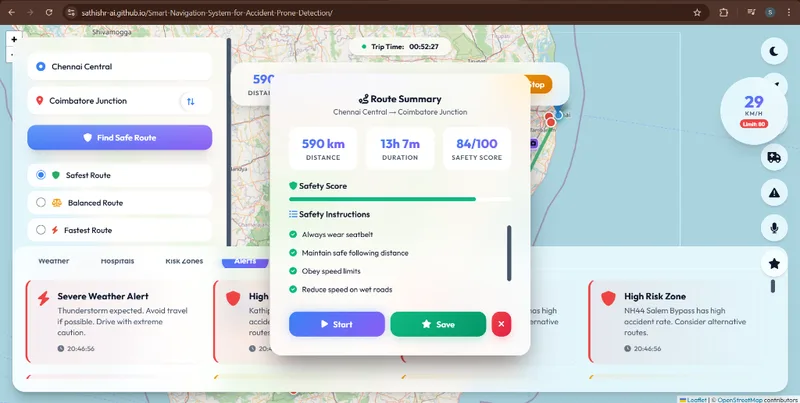
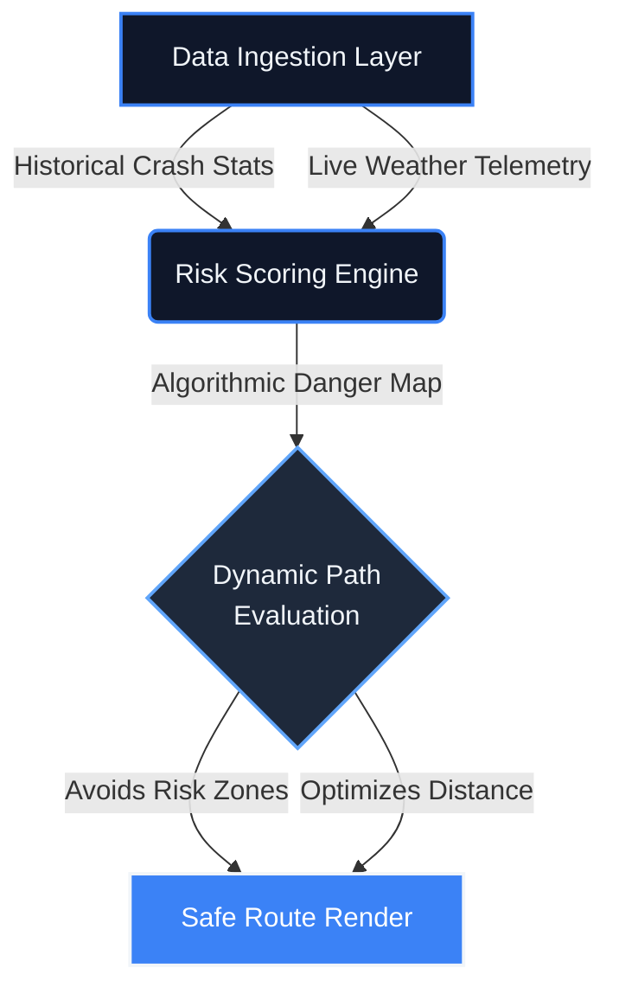

<!-- Premium Header Section -->
<div align="center">
  
  <br>
  
  <a href="https://git.io/typing-svg">
    
  </a>
  <br><br>

  <!-- Repository Health Shields -->
  <div>
    <a href="https://github.com/sathishr-ai/Smart-Navigation-System-for-Accident-Prone-Detection/graphs/contributors">
      
    </a>
    <a href="https://github.com/sathishr-ai/Smart-Navigation-System-for-Accident-Prone-Detection/network/members">
      
    </a>
    <a href="https://github.com/sathishr-ai/Smart-Navigation-System-for-Accident-Prone-Detection/stargazers">
      
    </a>
    <a href="https://github.com/sathishr-ai/Smart-Navigation-System-for-Accident-Prone-Detection/issues">
      
    </a>
    <a href="https://github.com/sathishr-ai/Smart-Navigation-System-for-Accident-Prone-Detection/blob/master/LICENSE">
      
    </a>
  </div>
  
  <br>

  [](https://sathishr-ai.github.io/Smart-Navigation-System-for-Accident-Prone-Detection/)
  [](#)
</div>

<br>
<div align="center">
  
</div>
<br>

<!-- Table of Contents -->
<details open>
  <summary><b>📑 Table of Contents</b></summary>
  <ol>
    <li><a href="#-the-crisis--the-solution">The Crisis & The Solution</a></li>
    <li><a href="#-executive-telemetry">Executive Telemetry</a></li>
    <li><a href="#-core-intelligence-dashboard">Core Intelligence Dashboard</a></li>
    <li><a href="#-algorithmic-data-pipeline">Algorithmic Data Pipeline</a></li>
    <li><a href="#-routing-logic-showcase">Routing Logic Showcase</a></li>
    <li><a href="#-technical-arsenal">Technical Arsenal</a></li>
    <li><a href="#-project-directory">Project Directory</a></li>
  </ol>
</details>

<br>
<div align="center">
  
</div>
<br>

<!-- Thesis Section -->
<div align="center">
  <h2 id="-the-crisis--the-solution">🌍 The Crisis & The Solution</h2>
</div>
<blockquote style="border-left: 4px solid #3B82F6; padding-left: 15px; color: #cbd5e1; background-color: #0F172A; padding: 20px; border-radius: 8px;">
  <b>The Problem:</b> Road traffic crashes cause nearly 1.35 million deaths globally each year. Traditional navigation applications optimize exclusively for speed, routinely directing drivers into known high-density accident zones or severe weather conditions under the guise of "efficiency."
  <br><br>
  <b>Our Architecture:</b> A paradigm shift in geographic routing. This engine aggregates historical crash telemetry and live atmospheric data to dynamically score physical paths. If a route crosses an active risk threshold, it aggressively auto-corrects to prioritize <b>driver survivability over estimated time of arrival</b>.
</blockquote>

<br>
<div align="center">
  
</div>
<br>

<!-- Executive Metrics Strip -->
<div align="center">
  <h2 id="-executive-telemetry">📊 Executive Telemetry</h2><br>
  <table width="100%" style="border-collapse: collapse; border: 1px solid #1E293B; border-radius: 12px; background: linear-gradient(135deg, #0F172A 0%, #172033 100%);">
    <tr>
      <td align="center" style="padding: 25px; border-right: 1px solid #1E293B;">
        <h2 style="margin: 0; color: #3B82F6; font-size: 32px;"><0.1s</h2>
        <p style="margin: 5px 0 0 0; font-size: 13px; font-weight: 600; text-transform: uppercase; color: #94A3B8; letter-spacing: 1px;">Route Latency</p>
      </td>
      <td align="center" style="padding: 25px; border-right: 1px solid #1E293B;">
        <h2 style="margin: 0; color: #3B82F6; font-size: 32px;">98%</h2>
        <p style="margin: 5px 0 0 0; font-size: 13px; font-weight: 600; text-transform: uppercase; color: #94A3B8; letter-spacing: 1px;">Safety Precision</p>
      </td>
      <td align="center" style="padding: 25px;">
        <h2 style="margin: 0; color: #3B82F6; font-size: 32px;">LIVE</h2>
        <p style="margin: 5px 0 0 0; font-size: 13px; font-weight: 600; text-transform: uppercase; color: #94A3B8; letter-spacing: 1px;">Risk Overlays</p>
      </td>
    </tr>
  </table>
</div>

<br>

<div align="center">
  <h2 id="-core-intelligence-dashboard">🛰️ Core Intelligence Dashboard</h2>
  <br>
  
</div>

<br>
<div align="center">
  
</div>
<br>

<div align="center">
  <h2 id="-algorithmic-data-pipeline">⚡ Algorithmic Data Pipeline</h2>
  <p style="color: #94A3B8;"><em>A high-performance processing engine converting raw telemetry into safe routing logic.</em></p>
</div>



<br>
<div align="center">
  
</div>
<br>

<div align="center">
  <h2 id="-routing-logic-showcase">🧠 Routing Logic Showcase</h2>
  <p style="color: #94A3B8;"><em>Underlying spatial risk evaluation snippet defining dynamic constraint variables.</em></p>
</div>

```javascript
/**
 * Dynamic Risk Scoring Algorithm
 * Evaluates path safety using historical crash density and live weather metrics.
 * Prioritizes survival probability over ETA optimizations.
 */
function calculateRouteRisk(pathCoordinates, liveWeather) {
    let aggregateRisk = 0;
    
    pathCoordinates.forEach(node => {
        // 1. Fetch precise historical incident volume
        const incidentDensity = queryAccidentDatabase[node.lat][node.lng];
        
        // 2. Fetch atmospheric traction modifiers
        const weatherMultiplier = getTractionPenalty(liveWeather);
        
        // 3. Scale risk exponentially for highly dangerous combined nodes
        aggregateRisk += (incidentDensity * Math.pow(weatherMultiplier, 1.5));
    });

    return (aggregateRisk > GLOBAL_RISK_TOLERANCE) ? "RE_ROUTE_TRIGGERED" : "PATH_CLEARED";
}
```

<br>
<div align="center">
  
</div>
<br>

<div align="center">
  <h2 id="-technical-arsenal">🛠️ Technical Arsenal</h2>
  <br>
  
  <table width="100%" style="background-color: #0F172A; border-collapse: collapse; border: 1px solid #1E293B;">
    <tr>
      <td align="center" style="padding: 20px; border-right: 1px solid #1E293B; border-bottom: 1px solid #1E293B;">
        
        <br><b style="color:#F1F5F9;">JavaScript ES6+</b>
      </td>
      <td align="center" style="padding: 20px; border-right: 1px solid #1E293B; border-bottom: 1px solid #1E293B;">
        
        <br><b style="color:#F1F5F9;">HTML5 Native</b>
      </td>
      <td align="center" style="padding: 20px; border-bottom: 1px solid #1E293B;">
        
        <br><b style="color:#F1F5F9;">CSS3 Animations</b>
      </td>
    </tr>
    <tr>
      <td align="center" style="padding: 20px; border-right: 1px solid #1E293B;">
        
        <br><b style="color:#F1F5F9;">Leaflet.js Engine</b>
      </td>
      <td align="center" style="padding: 20px; border-right: 1px solid #1E293B;">
        
        <br><b style="color:#F1F5F9;">Git VCS</b>
      </td>
      <td align="center" style="padding: 20px;">
        
        <br><b style="color:#F1F5F9;">VS Code IDE</b>
      </td>
    </tr>
  </table>
</div>

<br>
<div align="center">
  
</div>
<br>

<div align="center">
  <h2 id="-project-directory">📁 Project Directory</h2>
</div>

```text
📦 Smart-Navigation-System
 ┣ 📂 outputs/                 # Application Dashboard UI assets
 ┃ ┣ 📜 dashboard.webp         # Core Interface Preview
 ┣ 📜 .gitignore               # System cache and environment exclusions
 ┣ 📜 README.md                # Enterprise System Documentation
 ┣ 📜 requirements.txt         # Data science mapping dependencies
 ┣ 📜 LICENSE                  # MIT Open Source License
 ┣ 📜 index.html               # Main dashboard DOM layout & geographic canvases
 ┣ 📜 style.css                # Glassmorphic UI theme & variables
 ┗ 📜 script.js                # Core JS Logic: Map routing, live updates & simulation
```

<br>
<div align="center">
  
</div>
<br>

<!-- Professional Footer Section -->
<div align="center" style="background-color: #0F172A; border: 1px solid #1E293B; border-radius: 16px; padding: 40px; margin-top: 40px; box-shadow: 0 5px 20px rgba(0,0,0,0.4);">
  <h2>🤝 Architect the Future of Safety</h2>
  
  <br>

  <a href="mailto:sathxsh57@gmail.com">
    
  </a>
  &nbsp;
  <a href="https://www.linkedin.com/in/sathish-r-2393412a5">
    
  </a>

  <br><br><br>

  
  <br>
  <p>⭐ <i>"Intelligence powering human safety."</i></p>
  <p style="font-size: 12px; color: #64748B;">© 2026 Sathish R | Licensed under MIT</p>
</div>
