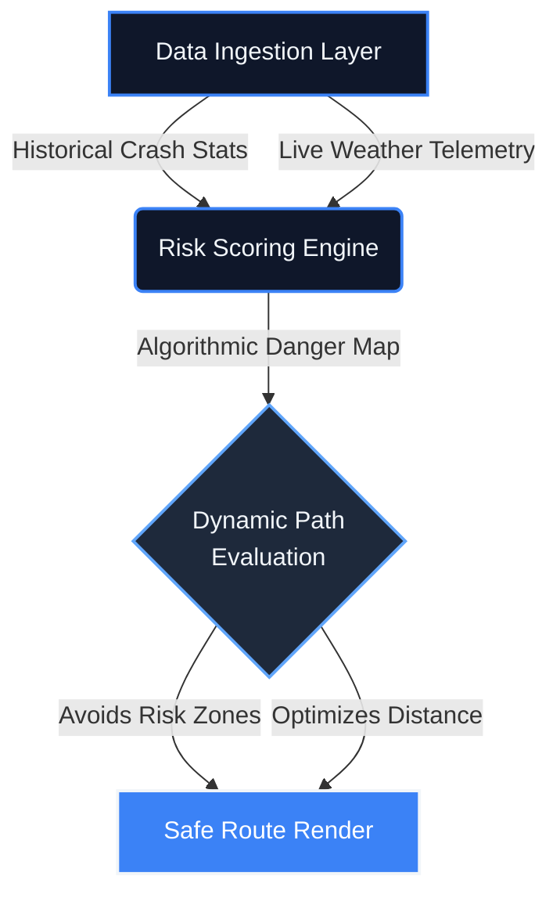

<!-- Pinnacle Header -->
<div align="center">
  
  <br>
  
  <a href="https://git.io/typing-svg">
    
  </a>
  
  <br><br>

  <!-- Action Cluster -->
  <a href="https://sathishr-ai.github.io/Smart-Navigation-System-for-Accident-Prone-Detection/">
    
  </a>
  &nbsp;
  <a href="#">
    
  </a>
  &nbsp;
  <a href="https://sathishdev.vercel.app/">
    
  </a>
</div>

<br>
<div align="center">
  
</div>
<br>

<!-- Architectural Thesis -->
<div align="center">
  <h2 style="color: #3B82F6; letter-spacing: 1px;">THE ARCHITECTURE OF SAFETY</h2>
  <p style="color: #94A3B8; max-width: 800px; font-size: 16px; line-height: 1.7;">
    Traditional navigation optimizes purely for speed. This geographic engine introduces a fundamental paradigm shift: combining historical crash telemetry with live atmospheric data to dynamically score physical paths. If a route crosses an active risk threshold, it aggressively auto-corrects to <b>prioritize driver survivability over estimated time of arrival</b>.
  </p>
</div>

<br>
<div align="center">
  
</div>
<br>

<!-- Executive Telemetry -->
<div align="center">
  <h2 style="letter-spacing: 1px;">EXECUTIVE TELEMETRY</h2><br>
  <table width="100%" style="border-collapse: collapse; border: 1px solid #1E293B; border-radius: 16px; background: linear-gradient(135deg, #0F172A 0%, #172033 100%); overflow: hidden;">
    <tr>
      <td align="center" style="padding: 35px; border-right: 1px solid #1E293B;">
        <h2 style="margin: 0; color: #3B82F6; font-size: 40px;"><0.1s</h2>
        <p style="margin: 8px 0 0 0; font-size: 14px; font-weight: 700; text-transform: uppercase; color: #94A3B8; letter-spacing: 2px;">Route Latency</p>
      </td>
      <td align="center" style="padding: 35px; border-right: 1px solid #1E293B;">
        <h2 style="margin: 0; color: #3B82F6; font-size: 40px;">98%</h2>
        <p style="margin: 8px 0 0 0; font-size: 14px; font-weight: 700; text-transform: uppercase; color: #94A3B8; letter-spacing: 2px;">Safety Precision</p>
      </td>
      <td align="center" style="padding: 35px;">
        <h2 style="margin: 0; color: #3B82F6; font-size: 40px;">LIVE</h2>
        <p style="margin: 8px 0 0 0; font-size: 14px; font-weight: 700; text-transform: uppercase; color: #94A3B8; letter-spacing: 2px;">Risk Updates</p>
      </td>
    </tr>
  </table>
</div>

<br>

<!-- Core Dashboard Mockup -->
<div align="center">
  <h2 style="letter-spacing: 1px;">CORE INTELLIGENCE DASHBOARD</h2>
  <br>
  
</div>

<br>
<div align="center">
  
</div>
<br>

<!-- Fluent Features -->
<div align="center">
  <h2 style="letter-spacing: 1px;">ADVANCED SAFETY FEATURES</h2>
  <br>
  
  <table width="100%" border="0" cellpadding="20" style="background-color: transparent;">
    <tr>
      <td width="50%" align="center" valign="top">
        
        <h3 style="margin-top: 15px; color: #F1F5F9;">Spatial Risk Avoidance</h3>
        <p style="color: #94A3B8; font-size: 15px; line-height: 1.6;">Dynamically calculates paths by dodging documented blockages, dense traffic, and historical high-risk accident hotspots using aggressive spatial logic.</p>
      </td>
      <td width="50%" align="center" valign="top">
        
        <h3 style="margin-top: 15px; color: #F1F5F9;">Live Environmental Telemetry</h3>
        <p style="color: #94A3B8; font-size: 15px; line-height: 1.6;">Integrates real-time constraints directly into routing, proactively warning drivers of severe storms, low visibility areas, and slippery roads.</p>
      </td>
    </tr>
    <tr>
      <td width="50%" align="center" valign="top">
        
        <h3 style="margin-top: 15px; color: #F1F5F9;">Critical Incident Response</h3>
        <p style="color: #94A3B8; font-size: 15px; line-height: 1.6;">Features proximity medical assistance plots, instantly locating nearby hospitals and providing one-touch SOS dialing to local authorities.</p>
      </td>
      <td width="50%" align="center" valign="top">
        
        <h3 style="margin-top: 15px; color: #F1F5F9;">Glassmorphic Enterprise UI</h3>
        <p style="color: #94A3B8; font-size: 15px; line-height: 1.6;">A stunning, modern web interface featuring responsive geographic canvases, blur backdrops, gradient overlays, and seamless theme switching.</p>
      </td>
    </tr>
  </table>
</div>

<br>
<div align="center">
  
</div>
<br>

<div align="center">
  <h2 style="letter-spacing: 1px;">ALGORITHMIC DATA PIPELINE</h2>
  <p style="color: #94A3B8;"><em>High-performance engine mapping raw telemetry into safe routing logic.</em></p>
</div>



<br>
<div align="center">
  
</div>
<br>

<div align="center">
  <h2 style="letter-spacing: 1px;">ROUTING LOGIC ENGINE</h2>
  <p style="color: #94A3B8;"><em>The mathematical constraint model evaluating hazard survivability.</em></p>
</div>

```javascript
/**
 * Dynamic Risk Scoring Algorithm
 * Prioritizes survival probability over ETA optimizations.
 */
function calculateRouteRisk(pathCoordinates, liveWeather) {
    let aggregateRisk = 0;
    
    pathCoordinates.forEach(node => {
        // Fetch precise historical incident volume
        const incidentDensity = queryAccidentDatabase[node.lat][node.lng];
        
        // Fetch atmospheric traction modifiers
        const weatherMultiplier = getTractionPenalty(liveWeather);
        
        // Scale risk exponentially for highly dangerous combined nodes
        aggregateRisk += (incidentDensity * Math.pow(weatherMultiplier, 1.5));
    });

    return (aggregateRisk > GLOBAL_RISK_TOLERANCE) ? "RE_ROUTE_TRIGGERED" : "PATH_CLEARED";
}
```

<br>
<div align="center">
  
</div>
<br>

<div align="center">
  <h2 style="letter-spacing: 1px;">TECHNICAL ARSENAL</h2>
  <br>
  
  <table width="100%" style="background-color: #0F172A; border-collapse: collapse; border: 1px solid #1E293B; border-radius: 16px; overflow: hidden; box-shadow: 0 10px 30px rgba(0,0,0,0.3);">
    <tr>
      <td align="center" style="padding: 30px; border-right: 1px solid #1E293B; border-bottom: 1px solid #1E293B;">
        
        <br><br><b style="color:#F1F5F9; font-size:15px; letter-spacing: 1px;">JS ES6+</b>
      </td>
      <td align="center" style="padding: 30px; border-right: 1px solid #1E293B; border-bottom: 1px solid #1E293B;">
        
        <br><br><b style="color:#F1F5F9; font-size:15px; letter-spacing: 1px;">HTML5</b>
      </td>
      <td align="center" style="padding: 30px; border-bottom: 1px solid #1E293B;">
        
        <br><br><b style="color:#F1F5F9; font-size:15px; letter-spacing: 1px;">CSS3</b>
      </td>
    </tr>
    <tr>
      <td align="center" style="padding: 30px; border-right: 1px solid #1E293B;">
        
        <br><br><b style="color:#F1F5F9; font-size:15px; letter-spacing: 1px;">Geospatial UI</b>
      </td>
      <td align="center" style="padding: 30px; border-right: 1px solid #1E293B;">
        
        <br><br><b style="color:#F1F5F9; font-size:15px; letter-spacing: 1px;">Git VCS</b>
      </td>
      <td align="center" style="padding: 30px;">
        
        <br><br><b style="color:#F1F5F9; font-size:15px; letter-spacing: 1px;">VS Code</b>
      </td>
    </tr>
  </table>
</div>

<br>
<div align="center">
  
</div>
<br>

<div align="center">
  <h2 style="letter-spacing: 1px;">SYSTEM DEPLOYMENT MATRIX</h2>
</div>

<details>
  <summary><b style="cursor: pointer; font-size: 16px; color: #3B82F6;">Click to expand local deployment instructions</b></summary>
  <br>
  
  <p>To bypass strict CORS constraints associated with local file rendering, you must spin up a secure local server environment.</p>
  
  ```bash
  # 1. Clone the intelligence repository
  git clone https://github.com/sathishr-ai/Smart-Navigation-System-for-Accident-Prone-Detection.git
  cd Smart-Navigation-System-for-Accident-Prone-Detection

  # 2. Bind application to a local port
  python -m http.server 8000
  ```
  **Access Point:** Navigate to `http://localhost:8000/index.html` in any Chromium-based browser to access the live dashboard.
</details>

<br><br>

<!-- Ultimate Engineering Signature -->
<div align="center">
  
</div>
<br><br>

<div align="center">
  <a href="https://sathishdev.vercel.app/">
    
  </a>
  
  <p style="color: #94A3B8; font-size: 16px; margin-top: 10px; max-width: 650px; line-height: 1.6;">
    <em>Building high-performance probabilistic models, resilient data pipelines, and highly scalable geographic architectures.</em>
  </p>
  
  <br>

  <a href="https://sathishdev.vercel.app/">
    
  </a>
  &nbsp;&nbsp;&nbsp;
  <a href="https://www.linkedin.com/in/sathish-r-2393412a5">
    
  </a>
  &nbsp;&nbsp;&nbsp;
  <a href="mailto:sathxsh57@gmail.com">
    
  </a>

  <br><br><br>
  
  
  
  <br><br>
  <p style="font-size: 13px; color: #475569; letter-spacing: 1px;">
    <b>© 2026 SATHISH R</b><br>
    Engineered for precision. Built for impact.
  </p>
</div>

<br><br>
<div align="center">
  
</div>
